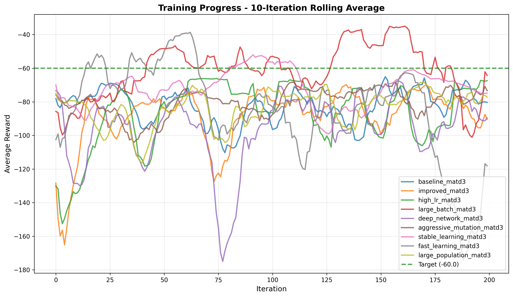
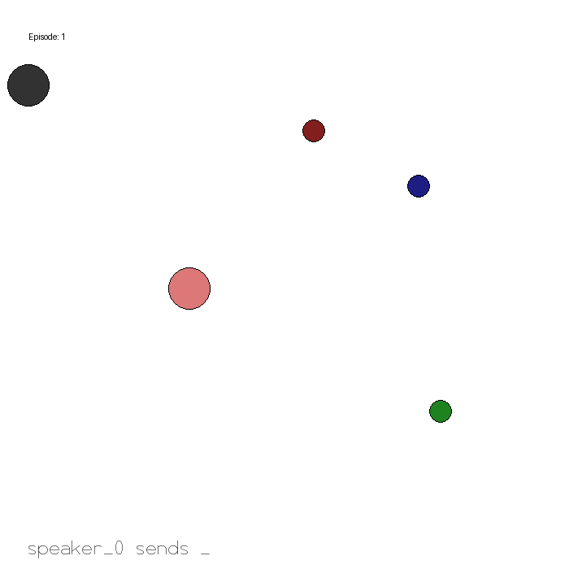

# Projeto Final: Aprendizado por Reforço Multi-Agente com SMPE e Otimização Evolucionária

**Autores:**

* Eduardo Vianna de Lima Fernandes Guimarães
* Isaque Vieira Machado Pim
* Juliano Genari de Araújo

**Data:** 29/11/2024

## Introdução

Este projeto implementa e analisa algoritmos de **aprendizado por reforço multi-agente (MARL)** em ambientes cooperativos parcialmente observáveis, com foco especial no algoritmo **SMPE (State Modeling with Adversarial Exploration)** integrado ao framework **AgileRL** para otimização evolucionária de hiperparâmetros.

O ambiente de teste utilizado é o **Simple Speaker Listener** da biblioteca MPE (Multi-Particle Environments), um benchmark clássico para avaliar comunicação e cooperação entre agentes em condições de observabilidade parcial. O projeto explora tanto algoritmos baseline (MATD3, MADDPG) quanto o estado-da-arte SMPE.

## Como Usar

### Setup Inicial

**Build da imagem Docker (apenas na primeira vez ou após mudar dependências):**
```bash
docker build -t projeto-final-rl:latest .
```

**Alternativa - Execução Local com uv:**
```bash
uv sync
```

### Executar Treinamento

**Com Docker (recomendado):**
```bash
# Usar configuração baseline MATD3 (padrão)
docker compose run --rm training

# Usar configuração SMPE
docker compose run --rm run_smpe

# Especificar uma configuração customizada
docker compose run --rm training python main.py --config configs/experiments/improved.yaml
```

**Executar múltiplos experimentos:**
```bash
# Rodar todos os experimentos automaticamente
./run_all_experiments.sh

# Rodar manualmente em sequência
for config in baseline high_lr fast_learning; do
  docker compose run --rm training python main.py --config configs/experiments/${config}.yaml
done

# Rodar em background
nohup docker compose run --rm training python main.py --config configs/experiments/deep_network.yaml > deep_network.log 2>&1 &
tail -f deep_network.log  # monitorar progresso
```

**Localmente:**
```bash
python main.py --config configs/experiments/baseline.yaml
```

### Visualizar Resultados

**Replay de modelos treinados:**
```bash
# Visualizar o modelo mais recente
docker compose run --rm replay

# Especificar um experimento
docker compose run --rm replay python replay.py --model exp_20251128_123149
```

**Análise e comparação de experimentos:**
```bash
# Plotar evolução de todos os experimentos
python plot_experiments.py

# Listar todos os experimentos
python compare.py --list

# Comparar experimentos específicos
python compare.py exp_20251128_123149 exp_20251128_134031

# Comparar múltiplos com plot customizado
python compare.py exp_001 exp_002 exp_003 --output my_comparison.png
```

### Resultados

Cada experimento é registrado em `results/experiments.csv` com métricas de desempenho (final_score, best_score, duration, etc).

Resultados detalhados por experimento em `results/exp_YYYYMMDD_HHMMSS/`:
- `exp_YYYYMMDD_HHMMSS_model.pt` - Modelo elite final
- `metrics.json` - Hiperparâmetros e métricas completas
- `scores_plot.png` - Gráfico de evolução
- `scores_data.npy` - Dados brutos para análise
- `exp_YYYYMMDD_HHMMSS_speaker_listener.gif` - Visualização do comportamento

## Experimentos Disponíveis

As configurações estão em `configs/experiments/`. Veja `configs/experiments/README.md` para detalhes completos.

### Configurações Pré-definidas

1. **baseline.yaml** - Configuração original de referência
2. **improved.yaml** - Melhorias balanceadas (redes mais profundas, maior exploração)
3. **high_lr.yaml** - Learning rates altos para aprendizado rápido
4. **large_batch.yaml** - Batches grandes para gradientes estáveis
5. **deep_network.yaml** - Redes muito profundas para aprendizado complexo
6. **aggressive_mutation.yaml** - Mutações evolutivas agressivas
7. **stable_learning.yaml** - Abordagem conservadora e estável
8. **fast_learning.yaml** - Atualizações muito frequentes
9. **large_population.yaml** - População grande para diversidade evolutiva

### Estrutura de Configuração

```yaml
name: "baseline_matd3"
description: "MATD3 baseline configuration"
seed: 42

training:
  max_steps: 2000000
  num_envs: 8
  evo_steps: 10000
  checkpoint_interval: 100000

hyperparameters:
  population_size: 4
  batch_size: 128
  lr_actor: 0.0001
  lr_critic: 0.001
  gamma: 0.95
  memory_size: 100000
  learn_step: 100
  tau: 0.01

network:
  latent_dim: 64
  encoder_hidden_size: [64]
  head_hidden_size: [64]

hpo_config:
  lr_actor:
    min: 0.0001
    max: 0.01
  lr_critic:
    min: 0.0001
    max: 0.01

mutation:
  no_mutation: 0.2
  architecture: 0.2
  new_layer: 0.2
  parameter: 0.2
  rl_hp: 0.2
```

### Criar Nova Configuração

```bash
# Copiar baseline como template
cp configs/experiments/baseline.yaml configs/experiments/my_experiment.yaml

# Editar configuração
vim configs/experiments/my_experiment.yaml

# Executar
docker compose run --rm training python main.py --config configs/experiments/my_experiment.yaml
```

# Nossa tentativa de inovação
## SMPE com HPO evolucionário em AgileRL

### Paper de origem

Esta implementação é baseada no paper **“Enhancing Cooperative Multi-Agent Reinforcement Learning with State Modelling and Adversarial Exploration (SMPE²)”**, aceito na **ICML 2025**, de Kontogiannis et al. ([GitHub][1])

O trabalho trata de **multi-agent deep reinforcement learning (MARL)** em ambientes cooperativos modelados como **Dec-POMDPs** (parcialmente observáveis, sem canal explícito de comunicação). O foco é:

* Aprender **representações de estado (beliefs)** a partir das observações locais de cada agente.
* Usar essas crenças para **melhorar cooperação e exploração** via *intrinsic motivation*.
* O método **SMPE/SMPE²** supera algoritmos MARL SOTA em tarefas cooperativas dos benchmarks **MPE, LBF e RWARE**. ([GitHub][1])

---

### Ideia por trás do SMPE / SMPE²

A ideia central do SMPE é adicionar, em cima de um algoritmo MARL padrão (no paper, **MAA2C**), duas camadas extras:

1. **State modelling auto-supervisionado**
   Cada agente (i) aprende um modelo que, a partir do seu histórico local $(\tau_t^i)$, infere uma **variável latente de crença** $(z_t^i)$ sobre o estado global não observado.

   * Isso é feito com um **encoder–decoder variacional (VAE)** que tenta reconstruir **partes informativas** das observações dos outros agentes usando apenas a observação própria. ([arXiv][2])
   * Para evitar redundância, o paper introduz os **Agent Modelling (AM) filters**: vetores de pesos $(w^i\in[0,1]^d)$ que dizem quanto cada feature dos outros agentes é relevante para o agente (i).

2. **Exploração intrínseca “adversarial” no espaço de crenças**
   Dado o embedding de crença $(z_t^i)$, o método constrói uma **recompensa intrínseca count-based**:

   * Usa **SimHash** para projetar $(z_t^i)$ num código discreto, conta visitas desse código e define um bônus $(r^{\text{int},i}_t \propto 1/\sqrt{N_i(\text{hash}(z_t^i))})$. ([arXiv][2])
   * Como os (z)’s também são alvos de reconstrução dos outros agentes, **descobrir crenças novas aumenta a perda de reconstrução deles**, forçando-os a melhorar seus modelos. Isso gera uma exploração **adversarial, mas pró-cooperação**: cada agente procura crenças novas que, ao mesmo tempo, enriquecem o modelo de estado dos demais.

O resultado é um backbone MARL “turbinado” com:

* crenças latentes **relevantes para a política** (não só para reconstrução), e
* uma política de exploração guiada nesses beliefs, em vez de diretamente no espaço de observações.

---

### Etapas do algoritmo

Resumindo o **Algoritmo SMPE/SMPE²**: ([arXiv][2])

1. Inicializar:

   * Actors e Critics do backbone MARL.
   * Encoders–decoders variacionais por agente (para o state modelling).
   * AM filters $(w^i)$ e suas redes.
   * *Replay buffer* compartilhado.

2. **Coleta de dados**
   Para cada passo de tempo:

   * Cada agente recebe observação local $(o_t^i)$.
   * Amostra crença $(z_t^i \sim q_\phi^i(z\mid\tau_t^i))$.
   * Amostra ação $(a_t^i \sim \pi_\theta^i(a\mid o_t^i, z_t^i))$.
   * Executa ações conjuntas, recebe recompensa global $(r_t)$ e novas observações.

3. **Cálculo de recompensa intrínseca**

   * Para cada agente, calcula hash de $(z_t^i)$ via SimHash, atualiza contagem e computa

     $( r^{\text{int},i}_t = \frac{\beta}{\sqrt{N_i(\text{hash}(z_t^i))}}.)$

   * Define a recompensa total usada no update de política como
     $(\tilde r_t^i = r_t + r^{\text{int},i}_t)$.

4. **Armazenamento**

   * Armazena transições $((o_t, a_t, \tilde r_t, o_{t+1}, \ldots))$ no *buffer*.

5. **Atualização do state modelling (VAE + AM filters)**
   Periodicamente, para cada agente:

   * Minimiza a **loss de reconstrução filtrada**
     $L*{rec}^i
     = E*{q_\phi^i(z\mid\tau)}
     \big| (o^{-i} \odot w^i) - \hat o^{-i}(z)\big|^2,$
     onde $(o^{-i})$ são observações dos outros agentes e $(\odot)$ é produto elemento a elemento. ([arXiv][2])
   * Adiciona:

     * termo **KL** para o VAE: $(\mathrm{KL}\big(q_\phi^i(z\mid\tau),|,\mathcal{N}(0,I)\big))$;
     * regularização L2 nos filtros $(w^i)$ para evitar colapso em zero.
   * A combinação desses termos define a loss de **state modelling** $(\mathcal{L}_{\text{SM}}^i)$.

6. **Atualização dos críticos e da política**

   * Mantém dois críticos:

     * um crítico “normal” $(V_\psi(s))$;
     * um crítico “com crenças” $(V_\omega(s, z^i))$ que vê o estado filtrado na perspectiva do agente. ([arXiv][2])
   * Minimiza erros TD correspondentes (loss de valor).
   * Atualiza o ator com gradiente de política usando estados estendidos $((o^i, z^i))$.
   * A loss total por agente combina:
     $(L^i = L_{SM}^i \cdot \lambda_V L_{crit}^i - \lambda_\pi J_{pol}^i.)$

7. **Loop até o fim do treinamento**, com updates periódicos de *target networks* e dos encoders–decoders para estabilizar o cálculo dos bônus intrínsecos.

Matematicamente, o paper mostra que o problema de **state modelling** é formulado de forma que o valor ótimo com beliefs $(z)$ é equivalente ao valor ótimo do Dec-POMDP original (Proposição 2.1), ou seja, introduzir $(z)$ **não restringe** o conjunto de políticas ótimas possíveis – ele só reparametriza o problema de forma mais informativa. ([arXiv][2])

---

### Nossa contribuição: SMPE + HPO evolucionário em AgileRL

A implementação deste repositório parte do **código oficial do SMPE/SMPE²** ([GitHub][1]) e o adapta para o ecossistema da biblioteca **[AgileRL](https://github.com/AgileRL/AgileRL)**, que é focada em **hiperparameter optimization (HPO) evolucionário** para RL. ([GitHub][3])

A principal ideia é:

* **Encapsular os componentes centrais do SMPE** (encoder–decoder de state modelling, AM filters, críticos adicionais, cálculo de bônus intrínseco) como um **`EvolvableModule`** do AgileRL. ([docs.agilerl.com][4])
* Permitir que a infraestrutura de **HPO evolucionário** do AgileRL faça *mutation* e *selection* não só de hiperparâmetros clássicos (learning rates, coeficientes $(\lambda)4, dimensão do embedding (z), peso da recompensa intrínseca (\beta) etc.), mas também de **submódulos da arquitetura SMPE**.

Em termos práticos:

* Os objetos do modelo foram reescritos herdando de `EvolvableModule`, ganhando suporte nativo a:

  * `.to(device)` integrado com o restante da lib;
  * registro automático de métodos de mutação;
  * participação transparente na **população evolutiva** usada para HPO.
* A nossa **versão de SMPE** é tratada como mais um algoritmo multi-agente do AgileRL, podendo:

  * ser instanciada em **populações** de agentes;
  * ser otimizada por **seleção de torneio + mutações** com base no retorno obtido, como descrito na documentação de HPO evolucionário da lib. ([docs.agilerl.com][5])

> **Inovação**
> A nossa contribuição principal é **combinar o SMPE com HPO evolucionário do AgileRL**, expondo os módulos de *state modelling* (incluindo os AM filters) como entidades evolutivas. Até onde sabemos, ainda não há na literatura uma integração pública de **SMPE + HPO evolucionário em AgileRL**, o que torna este repositório um primeiro passo nessa direção.

Isso significa que:

* o ajuste fino dos hiperparâmetros sensíveis do SMPE é automatizado;
* o algoritmo pode ser reusado em novos cenários (por exemplo, diferentes tarefas da MPE, LBF, RWARE ou outros ambientes PettingZoo) sem precisar redesenhar o tuning do zero;
* ganha-se um pipeline mais próximo de uso real: um único experimento com população evolutiva encontra tanto a política SMPE quanto uma configuração razoável de hiperparâmetros.

### Como Executar SMPE

**Treinar com configuração padrão:**
```bash
docker compose run --rm run_smpe
```

**Visualizar modelo SMPE treinado:**
```bash
# Replay automático do experimento mais recente
docker compose run --rm replay

# Especificar experimento SMPE
docker compose run --rm replay python replay.py --model exp_20251129_212113
```

---

## Resultados

### Tabela Comparativa de Experimentos

| Experimento | Algoritmo | Steps | Duração (h) | Score Médio | Score Final | Melhor Score | Pior Score |
|-------------|-----------|-------|-------------|-------------|-------------|--------------|------------|
| baseline_matd3 | MATD3 | 8M | 1.14 | -90.76 | -65.60 | -53.47 | -153.22 |
| improved_matd3 | MATD3 | 12M | 2.33 | -124.79 | -108.30 | -65.96 | -200.10 |
| high_lr_matd3 | MATD3 | 8M | 1.17 | -115.88 | -64.05 | -62.85 | -220.75 |
| large_batch_matd3 | MATD3 | 8M | 1.14 | -110.54 | -88.51 | -30.19 | -212.91 |
| deep_network_matd3 | MATD3 | 8M | 1.43 | -119.65 | -64.12 | -59.95 | -234.89 |
| aggressive_mutation_matd3 | MATD3 | 12M | 1.87 | -90.81 | -82.42 | -56.90 | -133.12 |
| stable_learning_matd3 | MATD3 | 8M | 2.10 | -80.87 | -73.49 | -48.36 | -120.76 |
| fast_learning_matd3 | MATD3 | 8M | 3.52 | -127.41 | -119.74 | -32.85 | -229.65 |
| large_population_matd3 | MATD3 | 16M | 2.98 | -97.77 | -77.32 | -64.62 | -151.37 |
| **smpe_baseline** | **SMPE** | **8M** | **1.19** | **-56.26** | **-41.44** | **-31.55** | **-95.79** |

**Observações:**
- Scores mais próximos de zero são melhores (menos penalização)
- Score Médio calculado como média aritmética de (Melhor + Final + Pior) / 3
- SMPE obteve o melhor score médio (-56.26), score final (-41.44) e melhor score (-31.55) comparado a todas as variações de MATD3
- O tempo de treinamento do SMPE foi competitivo (1.19h para 8M steps)

### Evolução do Treinamento

A figura abaixo mostra a evolução do treinamento de todos os experimentos completados, com médias móveis de 10 iterações:



A linha verde tracejada representa o score alvo de -60.

### Comportamento do Agente SMPE

Exemplo de execução do modelo SMPE treinado no ambiente Simple Speaker Listener:



O agente demonstra comportamento cooperativo entre speaker e listener para resolver a tarefa de comunicação.

---

## Referências

\[1\]: https://github.com/ddaedalus/smpe "GitHub - ddaedalus/smpe: [ICML 2025] Official Code of SMPE: \"Enhancing Cooperative Multi-Agent Reinforcement Learning with State Modelling and Adversarial Exploration\""

\[2\]: https://arxiv.org/html/2505.05262v1 "Enhancing Cooperative Multi-Agent Reinforcement Learning with State Modelling and Adversarial Exploration"

\[3\]: https://github.com/AgileRL/AgileRL?utm_source=chatgpt.com "AgileRL/AgileRL"

\[4\]: https://docs.agilerl.com/en/latest/api/modules/base.html?utm_source=chatgpt.com "EvolvableModule"

\[5\]: https://docs.agilerl.com/en/latest/evo_hyperparam_opt/index.html?utm_source=chatgpt.com "Evolutionary Hyperparameter Optimization"


